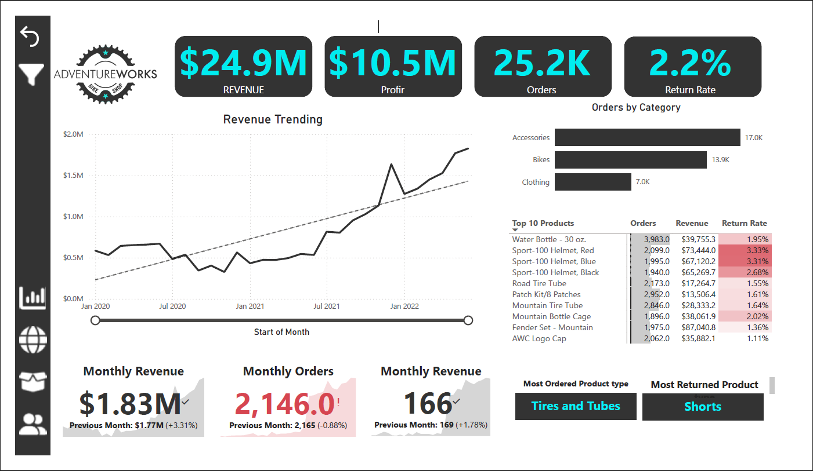
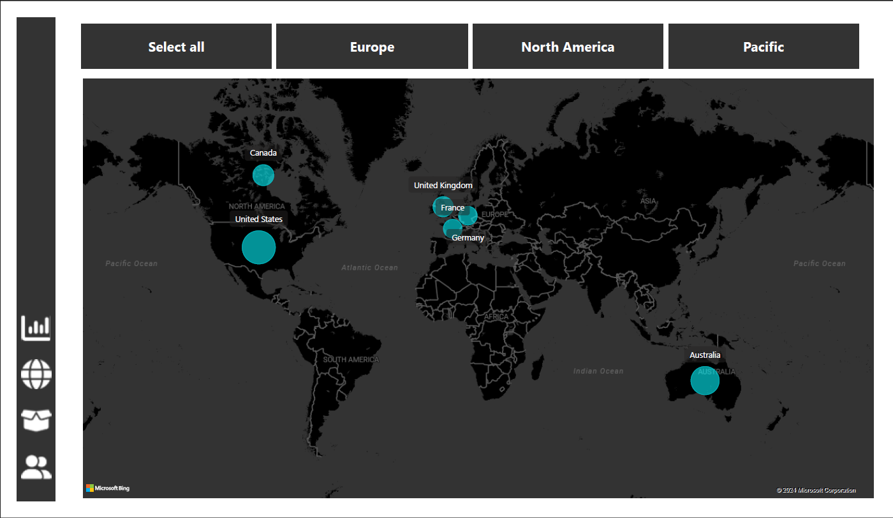
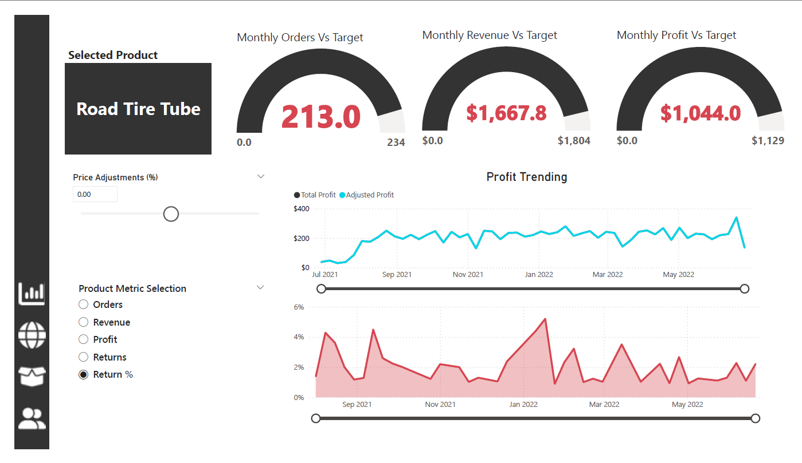
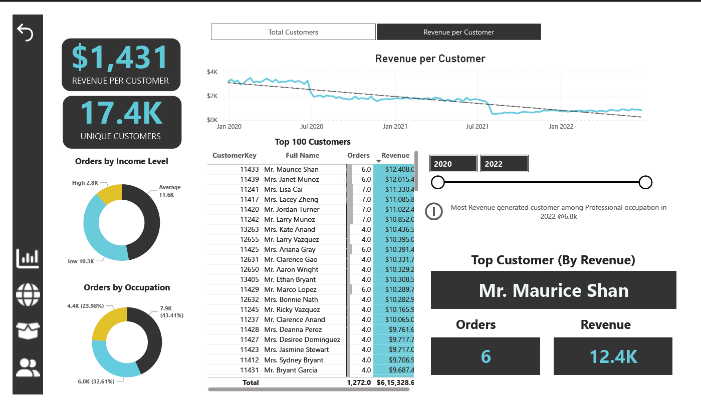

# 🚴 Adventure Works Sales & Customer Insights Dashboard | Power BI

---
Welcome to my interactive business intelligence project built using **Power BI Desktop**!  
In this case study, I’ve stepped into the role of a **Business Intelligence Analyst** at Adventure Works and tackled a real-world business challenge by transforming raw data into powerful insights.  

## 📊 Project Summary

This Power BI dashboard helps **Adventure Works** management track KPIs and uncover insights from raw sales and customer data.

> 🧠 **Role**: Business Intelligence Analyst  
> 🗂 **Tools**: Power BI, DAX, Power Query  
> 📈 **Skills**: Data modeling, data transformation, dashboard design

---

## 🖼️ Dashboard Preview

| Executive Summary | Regional Analysis | Product Trends | High-Value Customers |
|-------------------|-------------------|----------------|----------------------|
|  |  |  |  |

---

## 📌 Situation

Adventure Works needed a way to:

- Monitor KPIs like **Revenue**, **Orders**, **Profit**, and **Returns**
- Analyze **regional sales performance**
- Understand **product-level trends**
- Identify **top revenue-generating customers**

The only input? A folder full of raw `.csv` files.

---

## 🎯 Goal

To gain a strong grasp of **Power BI Desktop** capabilities and use them to tell meaningful stories with business data.

---

## 🔧 Objectives

1. 🔗 Connect and transform raw data in Power Query
2. 🧩 Build relationships and create a star schema
3. 🧮 Use DAX for measures and calculated columns
4. 📊 Build an interactive, multi-page Power BI dashboard

---
## 🧭 Project Workflow

This project followed a **real-world Business Intelligence lifecycle** using Microsoft Power BI:

### 🔌 Stage 1: Connecting & Shaping Data (Power Query)
- Data connectors, import modes
- Cleaning & transforming tables
- Pivoting, merging, aggregating
- Rolling calendars, conditional columns

### 🧩 Stage 2: Building the Data Model
- Star schema, fact & dimension tables
- Relationships (active/inactive), cardinality
- Data categories, hierarchies, filter flow

### 🧮 Stage 3: DAX Calculations
- Calculated columns vs. measures
- CALCULATE, FILTER, ALL, iterators
- Time intelligence (e.g., YTD, MoM)

### 📊 Stage 4: Data Visualization & Dashboarding
- KPI cards, trend lines, filters, slicers
- Drill-throughs, tooltips, bookmarks
- Key influencers, decomposition trees
- Publishing to Power BI Service

---

## 📋 Dashboard Pages

### 📌 Page 1: Executive Summary
- Key KPIs:  
  - **$24.9M Revenue**  
  - **$10.5M Profit**  
  - **25.2K Orders**  
  - **2.2% Return Rate**
- Trends & category breakdowns

### 🌍 Page 2: Regional Performance
- Country-wise analysis (US, UK, France, etc.)
- Performance vs. targets
- Profit trending visuals

### 📦 Page 3: Product Trends
- Top products by revenue and returns
- Category/subcategory drilldowns
- Return % by product type

### 👤 Page 4: High-Value Customers
- Top 100 customers
- Revenue by occupation and income level
- Key influencer analysis (e.g., homeowners)

---

## 📌 Key Insights

- 🏆 **Top Customer**: Mr. Maurice Shan – $12.4K revenue
- 🔁 **Most Returned Product Type**: Shorts
- 🚲 **Most Ordered Product**: Road Tire Tube
- 🌎 **Top Revenue Country**: United States

---

## 🧰 Tech Stack

| Tool | Usage |
|------|-------|
| **Power BI Desktop** | Dashboard development |
| **Power Query** | Data transformation |
| **DAX** | Custom calculations |
| **Star Schema Modeling** | Relational structure |

---

## 🔒 Future Improvements

- 🔐 Add **Row-Level Security** for regional stakeholders
- 🔄 Schedule refresh in Power BI Service
- 🤖 Use **AI visuals** for trend forecasting

---

## 🤝 Let’s Connect

If this project interests you or you’d like to collaborate:

📩 [Connect with me on LinkedIn](www.linkedin.com/in/manohark1999)  
⭐ Star this repo to support more case studies!

---

