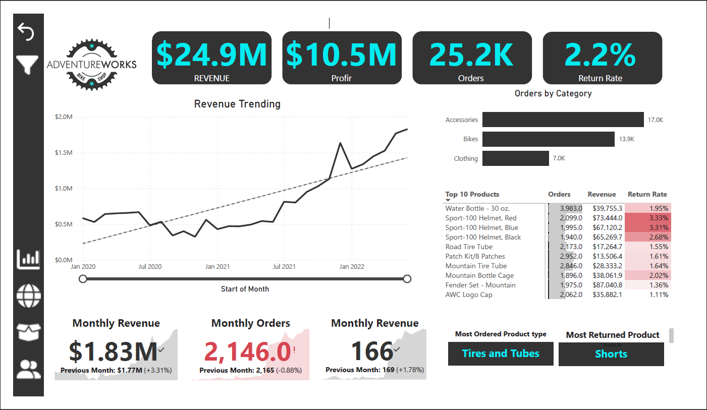
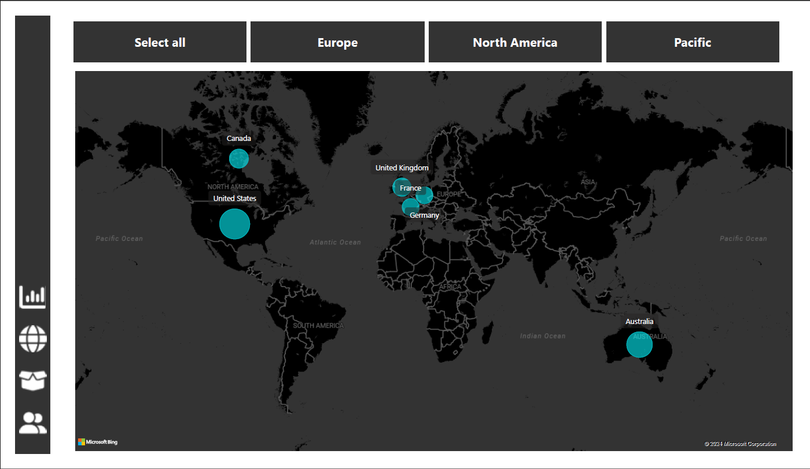
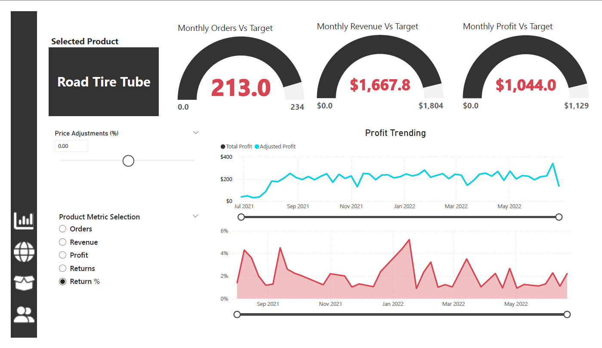
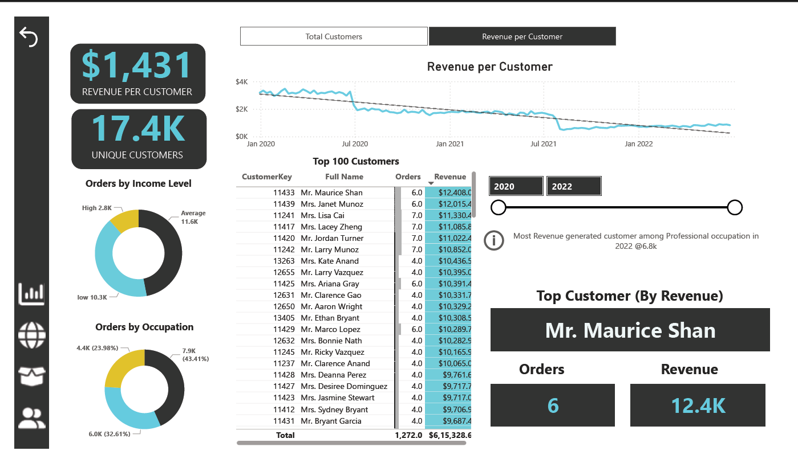

# 🚴 Adventure Works Sales & Customer Intelligence Dashboard  
### End-to-End Business Intelligence Project | Power BI


---

## 📌 Overview

This project is an end-to-end Business Intelligence solution built in **Power BI Desktop** using the Adventure Works dataset.

The goal was to transform raw `.csv` sales and customer data into an interactive, executive-level dashboard that supports:

- KPI monitoring  
- Regional performance analysis  
- Product-level trend analysis  
- Customer segmentation & revenue insights  
- Target vs actual performance tracking  
- What-if scenario simulation  

This dashboard enables stakeholders to identify performance gaps, optimize pricing strategy, and make data-driven decisions using interactive analytics.

---

## 🖼️ Dashboard Preview

| Executive Summary | Regional Analysis | Product Trends | High-Value Customers |
|-------------------|-------------------|----------------|----------------------|
|  |  |  |  |

---

## 📊 Key Metrics at a Glance

- 💰 $24.9M Total Revenue  
- 📦 25.2K Total Orders  
- 📈 $10.5M Total Profit  
- 🔁 2.2% Overall Return Rate  
- 👥 17.4K Unique Customers  

---

## 📂 Download the Power BI File

You can download the full interactive Power BI report here:

👉 [Download AdventureWorks_Report.pbix](AdventureWorks_Report.pbix)

---

## 🧠 Business Problem

Adventure Works management needed a centralized reporting solution to:

- Track **Revenue, Orders, Profit, and Return Rate**
- Identify underperforming regions and product categories
- Analyze product returns and profitability
- Discover high-value customers
- Evaluate performance against monthly targets
- Simulate pricing impact on profit

The available data consisted only of raw operational CSV files.

---

## 🏗️ Solution Architecture

This project follows a structured Business Intelligence development lifecycle:

### 1️⃣ Data Transformation (Power Query)

- Data cleaning & shaping  
- Table merging and transformations  
- Rolling calendar table creation  
- Conditional columns & aggregations  
- Data type optimization  

### 2️⃣ Data Modeling

- Implemented a **Star Schema**
- Fact table: Sales  
- Dimension tables: Product, Customer, Geography, Date  
- Managed active/inactive relationships  
- Optimized filter flow  

### 3️⃣ DAX & Advanced Calculations

- Revenue, Profit, Return %, Orders measures  
- Time intelligence (MoM, YTD)  
- Target vs Actual calculations  
- What-if parameter for price adjustments  
- Adjusted Profit simulation  
- Customer segmentation metrics  

### 4️⃣ Dashboard & UX Design

- Executive KPI cards  
- Trend analysis visuals  
- Drilldowns & hierarchical navigation  
- Decomposition tree  
- Key Influencers visual  
- Region-level filtering experience  
- Interactive What-if slider  

---

## 🧮 Sample DAX Measures

Below are a few core measures used in this dashboard:

```DAX
Total Revenue = SUM(Sales[Revenue])

Total Orders = DISTINCTCOUNT(Sales[OrderNumber])

Return % = 
DIVIDE(
    [Total Returns],
    [Total Orders]
)

Adjusted Profit =
[Total Revenue] * (1 + SELECTEDVALUE('Price Adjustment'[Adjustment %]))
    - [Total Cost]
```     

---

## 📊 Dashboard Pages

### 📌 1. Executive Summary

- **$24.9M Revenue**  
- **$10.5M Profit**  
- **25.2K Orders**  
- **2.2% Return Rate**  
- Revenue trends, category breakdowns, and top product analysis
- Most ordered & most returned product types  

---

### 🌍 2. Regional Performance

- Country-level sales analysis  
- Region segmentation (Europe, North America, Pacific)  
- Performance comparison  
- Geo-based visual insights  

---

### 📦 3. Product & Target Analysis

- Monthly Orders vs Target  
- Revenue vs Target  
- Profit vs Target  
- Price Adjustment What-if simulation  
- Profit trend comparison (Actual vs Adjusted)  
- Return % tracking over time  

---

### 👤 4. Customer Intelligence

- Revenue per Customer  
- Unique Customers (17.4K)  
- Top 100 customers  
- Income-level segmentation  
- Occupation analysis  
- Key Influencers analysis  

**Top Customer:**  
- Mr. Maurice Shan – $12.4K Revenue  

---

### 🧩 5. Product Hierarchy Drilldown

- Total Orders → Category → Subcategory → Product  
- Full decomposition for granular analysis  
- Demonstrates strong relational modeling  

---

## 📈 Key Insights

- 🌎 **United States** is the top revenue-generating region  
- 🚲 **Road Tire Tube** is the most ordered product  
- 🔁 **Shorts** have the highest return rate among product types  
- 💰 Revenue per customer is trending downward over time  
- 🧠 Professionals show strong revenue contribution in 2022  

---

## 💡 Business Recommendations

- Reduce return rates in the Clothing category (especially Shorts)  
- Increase cross-selling in high-volume categories like Tires & Tubes  
- Expand targeted campaigns in high-performing regions (US)  
- Develop loyalty strategies for high-income professionals  
- Monitor pricing strategy impact using What-if simulation  

---

## 🛠️ Tech Stack

| Tool | Purpose |
|------|---------|
| **Power BI Desktop** | Dashboard development |
| **Power Query** | Data transformation |
| **DAX** | Business calculations |
| **Star Schema Modeling** | Data modeling |
| **What-if Parameters** | Scenario simulation |

---

## 📂 Repository Structure

```
ADVENTURE-WORKS-POWER-BI-DASHBOARD/
│
├── 📁 AdventureWorks Raw Data/        # Source CSV files used for modeling
├── 📁 images/                         # Dashboard preview screenshots
├── 📊 AdventureWorks_Report.pbix      # Power BI report file
├── 📄 Report.pdf                      # Exported dashboard report (PDF)
└── 📘 README.md                       # Project documentation
``` 
---

## 🔮 Future Enhancements

- Implement Row-Level Security (RLS)  
- Schedule automatic refresh in Power BI Service  
- Add forecasting models  
- Enhance mobile-optimized layout  
- Deploy to Power BI Service workspace  

---

## 🤝 Connect With Me

If you're hiring for **Data Analyst, Business Analyst, or Power BI Developer** roles - I’d love to connect.


[](https://www.linkedin.com/in/manohark1999)
[](mailto:manoharmanu.k1999@gmail.com)
[](https://github.com/ManoharManu1999)


⭐ If you found this project useful, consider starring the repository!
